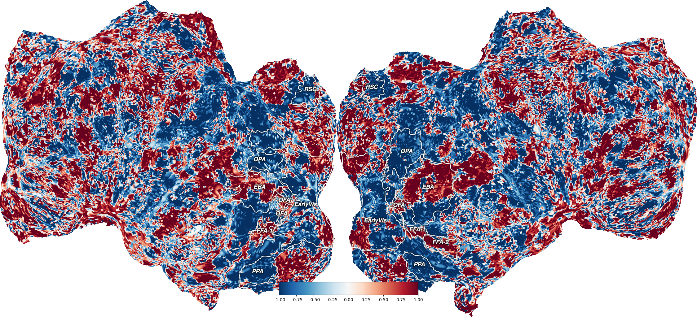

# Voxelwise Encoding Models with Multimodal Features and fMRI Data

## Project Overview

This project focuses on building voxelwise encoding models using features extracted from large multimodal models (MMLs) and fMRI data. The goal is to use these features to predict brain activity and provide a comparative analysis between human brain responses and the internal representations of large MMLs. By doing so, this project aims to contribute to model interpretability, bridging the gap between artificial intelligence and cognitive neuroscience.

## Table of Contents

- [Introduction](#introduction)
- [Features](#features)
- [Data](#data)
- [Methodology](#methodology)
- [Results](#results)
- [Conclusion](#conclusion)
- [Installation](#installation)
- [Usage](#usage)
- [Contributing](#contributing)
- [License](#license)
- [Acknowledgments](#acknowledgments)

## Introduction

In recent years, large multimodal models (MMLs) have demonstrated remarkable capabilities across various tasks. However, understanding how these models process information and how their internal representations compare to human brain activity remains an open challenge. This project seeks to address this challenge by developing voxelwise encoding models that map the relationship between features extracted from MMLs and brain activity measured via fMRI.

## Features

- **Voxelwise Encoding**: Models that predict brain activity on a voxel-by-voxel basis.
- **Multimodal Feature Extraction**: Utilizes features from state-of-the-art multimodal models.
- **Comparative Analysis**: Compares the internal representations of MMLs to human brain activity.
- **Model Interpretability**: Aims to provide insights into the interpretability of MMLs through the lens of cognitive neuroscience.

## Data

- **fMRI Data**: Functional Magnetic Resonance Imaging data representing brain activity.
- **MML Features**: Features extracted from large multimodal models, such as text, image, or combined modalities.

### Data Sources
3 potential fMRI data sources can be used:
1) [Natural Scenes Dataset](https://naturalscenesdataset.org/) A whole-brain, high-resolution fMRI dataset of healthy adult subjects viewing thousands of color natural scenes. To build a **visual** encoding model
2) [Shortclips](https://doi.gin.g-node.org/10.12751/g-node.vy1zjd/) fMRI dataset of human subjects viewing a set of natural short clips. To build a **visual** encoding model
3) [Textgrids](https://www.nature.com/articles/s41597-023-02437-z) fMRI dataset of human subjects listening to a set of natural, narrative stories. To build a **language** encoding model


## Methodology

### Model Architecture

- Based on model selection, stimuli features were either extracted from the [BridgeTower Model](https://huggingface.co/docs/transformers/en/model_doc/bridgetower) or [LLaVA 1.6](https://github.com/haotian-liu/LLaVA). Features were extracted in a way that matched the presentation of stimuli to humans in the MRI scanner. For example, if humans watched videos at 30 frames per second and the MRI sampled their brain activity every second (TR = 1), features from the model were averaged in batches of 30 frames.
- A multi-target ridge regression model (using the [Himalaya](https://gallantlab.org/himalaya/index.html) python package) was trained on the feature data to learn fMRI data. This data not only generates specific weights and biases for the relationship between all the training data and each individual target, but it also selects the best regularization parameter for each voxelwise calculation.

### Training

- With the Himalaya model, [KernelRidgeCV](https://gallantlab.org/himalaya/models.html), we selected the alpha regularization paramater, alpha, using a 7-fold cross-validation scheme, for each voxel-based regression model over a specificed alpha range. With our most common pipeline, feature and fMRI data was divided into train and test sets using a 85/15 split.

### Evaluation

- Models were evaulated based on their Pearson correlation and R-squared score between predicted and real fMRI data.
- Models were further evaluated in the scope of well-known phenomenon in cognitive neuroscience by comparing predicted activity to face stimuli and landscape/scene stimuli

## Results

### Model Performance
#### Voxel-wise Pearson correlation
<div align="center">
  
  
  <br>
  <i>Voxelwise correlations for two different subjects</i>
</div>

#### Voxel-wise R-squared Scores
<div align="center">
  
  
  <br>
  <i>Voxelwise R-squared values for two different subjects</i>
</div>

### Face vs Land prediction
In the human brain, the fusiform face (FFA) is known to be sensitive to the presentation of faces while the extrastriate body area (EBA) is sensitive to human bodies and body parts. This effect is very easily captured with an fMRI signal so if our models are trained well to the data, they should predict FFA activity in response to images with faces, and since there are bodies in these images too, we will likely see EBA activation.
<div align="center">
  
  <br>
  <i>Voxelwise predictions for images containing human face</i>
</div>

In contrast, there are three main areas that respond to landscape images: the parahippocampal place area (PPA), retrosplenial complex (RSC), and occipital place area (OPA). These scene-selective areas should contain high predictive values when our model is predictivity activity from landscape image features.
<div align="center">
  
  <br>
  <i>Voxelwise predictions for images containing landscapes</i>
</div>

## Conclusion
fMRI research has been around for decades, leaving a surplus of data regarding all kinds of cognitive phenomena detailing cognition and perception, learning and memory, and more specific occurences of brain function and dysfunction.
Using these data we can better understand what information features in AI models represent on a human-level. By comparing and contrasting these representations, we can better guage the best use and development projectory of large language and multimodal models.
Applying cognitive neuroscience perspectives is crucial for model interpretability. To understand new forms of intelligence we must compare it to the most well known and researched intelligence, the human brain.


## Installation

Instructions on how to install the necessary dependencies and set up the environment to run the project.

```bash
# Example command to set up the environment
pip install -r requirements.txt
```

## Usage

The main script `llava_nsd_pipeline.py` contains all the parameters and calls to run the model features to fMRI prediction pipeline. This code was run using GPU acceleration on an HPC cluster. `cuda_crossmodal_1.1.def` contains all the requirements needed to set up an Apptainer container for running the pipeline using this script.

## License
Apache 2.0

## Acknowledgements
All researchers who've contributed to the literature on voxelwise encoding models and particularly using them 
with AI models. The papers below were crucial to the development of this project:

[Better models of human high-level visual cortex emerge from natural language supervision with a large and diverse dataset](https://www.nature.com/articles/s42256-023-00753-y)

[Brain encoding models based on multimodal
transformers can transfer across language and vision](https://arxiv.org/abs/2305.12248)
